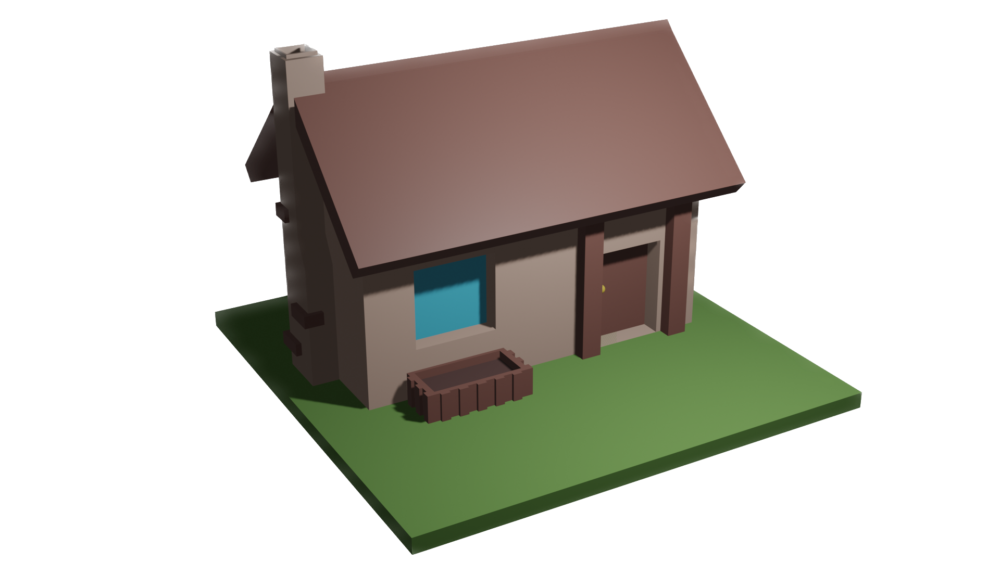

# Villaggio Virtuale

Benvenuti nel nostro progetto di realtà aumentata: il **Villaggio Virtuale!**
Con questa innovativa esperienza potrai immergerti in un affascinante mondo virtuale, 
dove potrai organizzare il tuo villaggio tramite i marker. 

Sfruttando un tuo dispositivo e la potenza dell'AR potrai posizionare gli edifici e la strada nel tuo ambiente reale. 
Scegli tra una vasta gamma di elementi e personalizza il tuo villaggio secondo i tuoi desideri.

Questo progetto ti offre la possibilità di dare vita al tuo sogno di costruire 
un villaggio unico, tutto grazie alla magia della realtà aumentata.

### Tecnologie usate
Per creare il progetto è stata sfruttata la libreria per la realtà aumentata AR.js

### Istruzioni per l'uso
1. Scaricare il file stampa-marker.pdf
2. Stampare il file stampa-marker.pdf, in corrispondenza dei marker verranno visualizzate gli edifici
3. Con un dispositivo (preferibilmente mobile) andare a questa [pagina web](https://github.com/mattiamonti/AR-Project)
4. Dare le autorizzazioni alla fotocamera richieste per far funzionare l'esperienza
5. Inquadrare i marker così da veder comparire gli edifici
